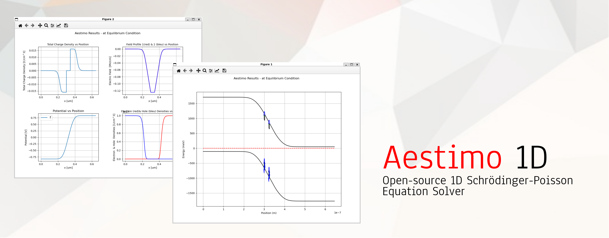

Aestimo is a one-dimensional (1D) self-consistent Schrödinger-Poisson solver for semiconductor heterostructures. Aestimo is started as a hobby at the beginning of 2012, and become an usable tool which can be used as a co-tool in an educational and/or scientific work.

Aestimo is a [GPL](http://www.gnu.org/copyleft/gpl.txt) software, written by a team of [developers](authors.md). The code is hosted on [Github](https://github.com/aestimosolver/aestimo).

Please,
* Report bugs or [browse opened issues](https://github.com/aestimosolver/aestimo/issues).
* [Browse the code](https://github.com/aestimosolver/aestimo).
* [Contribute!](development.md)

# Latest Aestimo

Latest stable version of Aestimo is v3.0.0 (July 13th, 2022).

Or, you can use PIP:

    $ pip install aestimo

Please [read PIP installation part of the document](https://github.com/aestimosolver/aestimo/blob/gh-pages/documentation.md#pip-installation) for the full installation steps.

Or, you can prefer to use [latest development version](https://github.com/aestimosolver/aestimo/archive/refs/heads/master.zip).

Please read [documentation](documentation.md) before downloading or visit [release notes](releasenotes.md) page for more information.

## Cite Information
We will appreciate if any scientific work done using Aestimo 1D will contain an acknowledgment and the following reference:

* **H. Hebal, Z. Koziol, S.B. Lisesivdin, and R. Steed "General-purpose open-source 1D self-consistent Schrödinger-Poisson Solver: Aestimo 1D" *Comput. Mater. Sci.* 186, 110015 (2021).**

# News

**July 2022**

* [Aestimo 1D version 3.0](https://aestimosolver.github.io/aestimo/) is released. This is a major release nearly again 2 years after. Because the code base was complicated and the usage of Aestimo was hard to understand before, this release is mostly a simplification and clean-up release. Enjoy the simplified usage of Aestimo! Please visit to [release notes](https://aestimosolver.github.io/aestimo/releasenotes.html#v300-july-13-2022) for more information.
 
**November 2020**

* The old aestimo_elementary branch has now been moved to its own new repository, and it has been renamed Aestimo EDU. With its simple and %100 pure Python code structure, it is very suitable for use in education. The codebase can be found at [https://github.com/aestimosolver/aestimo-edu](https://github.com/aestimosolver/aestimo-edu), and the latest code zip package can be downloaded at [https://github.com/aestimosolver/aestimo-edu/archive/main.zip](https://github.com/aestimosolver/aestimo-edu/archive/main.zip).

**September 2020**

* Our reference paper “[General-purpose open-source 1D self-consistent Schrödinger-Poisson Solver: Aestimo 1D](https://doi.org/10.1016/j.commatsci.2020.110015)” which gives  a general overview of the Aestimo 1D has been published online!

**March 2020**

* [Aestimo 1D version 2.0](https://aestimosolver.github.io/aestimo/releasenotes.html#v20-march-28-2020) is released. This is a major release nearly after 2 years. We would like to thank Hamza Hebal for his efforts and contributions. There are many new features added in this release. Please refer [Release Notes](https://www.aestimosolver.org/releasenotes.html#v20-march-28-2020) pages for details of these contributions.
* The project website is now using the* just-the-docs* theme, which is more document-focused. We want to give more importance to documentation in the future (10 Mar 2020).

**July 2018**

* [Aestimo 1D version 1.2.1](https://aestimosolver.github.io/aestimo/releasenotes.html#v121-july-22nd-2018) is released. Thanks to Robert Steed. This is a minor release that fixes some issues with using aestimo as a system package in python3 and makes some changes to the intersubband_optical_transitions.py (22 Jul 2018).

**November 2017**

* [Aestimo 1D version 1.2.0](https://aestimosolver.github.io/aestimo/releasenotes.html#v12-november-6th-2017) is released. Thanks to Robert Steed and Hamza Hebal for making Aestimo better (06 Nov 2017).

**April 2017**

* Project website https://www.aestimosolver.org is moved to Github.
* Today, we moved all our code and issue management from BitBucket to GitHub. You can find the code at github.com/sblisesivdin/aestimo. Now, with this move, we want to open our code to the large user base of GitHub and expect new committers as many as we can find. This move also makes it easier for everyone to contribute to aestimo. No single line of code is lost; it just moved to another place. This is how we try to make this change for everyone as comfortable as possible (04 Apr 2017).

**November 2016**

* Aestimo has been uploaded to PyPI and can now be installed using a simple `pip install aestimo`. This should also compile the cython extension automatically. You can find it at https://pypi.python.org/pypi/aestimo. Imagine - you can now distribute your aestimo input script and simply tell someone to do `pip install aestimo` before running the script! Particularly since Python is now a popular language for science, this is no longer something esoteric to suggest someone to do. Well, one can dream! (11 Nov 2016)

* [Aestimo 1D version 1.1.0](https://aestimosolver.github.io/aestimo/releasenotes.html#v11-november-8th-2016) released. Thanks to Robert Steed for this release (08 Nov 2016).

**December 2015**

* We are happy to announce our new domain name, http://www.aestimosolver.org/. The old domain, http://aestimo.ndct.org, will soon be changed to a forward page (12 Apr 2015).

**November 2014**

* We have uploaded a new tutorial about modeling the optical absorption of intersubband transitions in quantum wells. There is a module in aestimo specifically for these calculations (intersubband_optical_transitions.py) since the intersubband transitions can be surprisingly shifted from the frequencies of their underlying energy levels due to interactions between the electrons occupying the quantum well. The tutorial is released as an ipython notebook (tutorial4) and can also be found in the tutorials directory of the aestimo package (22 Nov 2014).

**August 2014**

* [Aestimo 1D version 1.0.0](https://aestimosolver.github.io/aestimo/releasenotes.html#v10-august-29th-2014) released. The Aestimo Team is proud to release version 1.0.0 of Aestimo 1D Self-consistent Schrödinger-Poisson Solver. This version includes many bug fixes, a new organization of the structure, wurtzite material use, and lots of changes in the intersubband optical transitions module. Dielectric constants are now handled more accurately. Many tutorials have been added in the form of ipython notebooks. The code is heavily modified and stabilized with more than 60 commits. This version is the most feature-rich and stable version so ever  (29 Aug 2014).
* [Aestimo 1D version "elementary"](https://aestimosolver.github.io/aestimo/releasenotes.html#v10-august-29th-2014) released. This version is easy to understand in terms of coding, and therefore it can be used in undergraduate /graduate courses and forking new solvers. There will be no other release for the “elementary” version (29 Aug 2014).

**June 2014**

* Developer Robert Steed uploaded a new tutorial about the latest state of the Aestimo solver and general usage. It includes information about all solvers available, all main files, and modeling a structure. It includes many figures, and it will answer most of your questions (09 Jun 2014).

**November 2013**

* [Aestimo 1D version 0.9.0](https://aestimosolver.github.io/aestimo/releasenotes.html#v09-november-10th-2013) released. This version includes many bug fixes, speed improvements, cython code additions, rewritten VBMAT-V part to use numpy better, merging conduction and valance band calculations, and more. The code is heavily modified and stabilized (10 Nov 2013).

**July 2013**

* [Aestimo 1D version 0.8.0](https://aestimosolver.github.io/aestimo/releasenotes.html#v08-july-7th-2013) released. This version includes many new features, bug fixes, and small corrections. The most important feature, which has been added to Aestimo recently, is the implementation of strain-included valence band calculation with a 3×3 k.p model. Also, the Numpy version is restructured, the input file structure and sample inputs are changed, and the non-parabolicity of the conduction band is implemented (Numpy version only). In addition, the database has been changed to a clearer and more understandable structure, and exchange interaction potential has been implemented (Numpy version only). Logging with timers, some customizations in the config, and the possibility of looping the simulation over a parameter are also added to the new version. Aestimo can now work with new materials InAs, InP, AlP, GaP, and new alloys InGaAs, InGaP, and AlInP in addition to GaAs and AlGaAs (07 July 2013).

**June 2013**

* Because the Bitbucket wiki suffers from a lack of features, we are now moving our wiki to a new domain: http://aestimo.ndct.org/. One of our committers maintains the hosting and subdomain. With the new site, we can include figures and equations, making this site usable for all documentation needs. This site will have everything users need to learn, download, and use the aestimo (28 Jun 2013).

**April 2013**

* [Aestimo 1D version 0.7.0](https://aestimosolver.github.io/aestimo/releasenotes.html#v07-april-27th-2013) released (27 Apr 2013).

**February 2013**

* [Aestimo 1D version 0.6.0](https://aestimosolver.github.io/aestimo/releasenotes.html#v06-february-2013) released (Feb 2013).

**January 2013**

* [Aestimo 1D version 0.5.0](https://aestimosolver.github.io/aestimo/releasenotes.html#v05-january-2013) released (Jan2013).

**November 2012**

* [Aestimo 1D version 0.4.0](https://aestimosolver.github.io/aestimo/releasenotes.html#v04-november-2012) released (Nov 2012).

**October 2012**

* [Aestimo 1D version 0.3.0](https://aestimosolver.github.io/aestimo/releasenotes.html#v03-october-2012) released (Oct 2012).

**September 2012**

* [Aestimo 1D version 0.2.1](https://aestimosolver.github.io/aestimo/releasenotes.html#v021-september-2012) released (Sep 2012).

**June 2012**

* [Aestimo 1D version 0.2.0](https://aestimosolver.github.io/aestimo/releasenotes.html#v02-june-2012) released (Jun 2012).

**March 2012**

* [Aestimo 1D version 0.1.0](https://aestimosolver.github.io/aestimo/releasenotes.html#v01-march-2012) released (Mar 2012).
